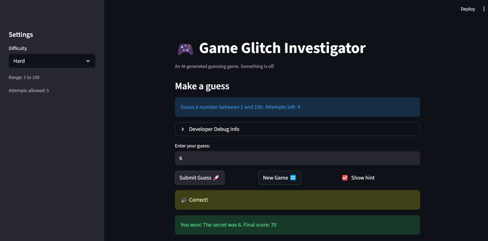
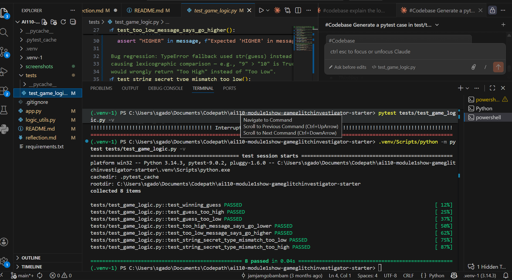

# 🎮 Game Glitch Investigator: The Impossible Guesser

## 🚨 The Situation

You asked an AI to build a simple "Number Guessing Game" using Streamlit.
It wrote the code, ran away, and now the game is unplayable. 

- You can't win.
- The hints lie to you.
- The secret number seems to have commitment issues.

## 🛠️ Setup

1. Install dependencies: `pip install -r requirements.txt`
2. Run the broken app: `python -m streamlit run app.py`

## 🕵️‍♂️ Your Mission

1. **Play the game.** Open the "Developer Debug Info" tab in the app to see the secret number. Try to win.
2. **Find the State Bug.** Why does the secret number change every time you click "Submit"? Ask ChatGPT: *"How do I keep a variable from resetting in Streamlit when I click a button?"*
3. **Fix the Logic.** The hints ("Higher/Lower") are wrong. Fix them.
4. **Refactor & Test.** - Move the logic into `logic_utils.py`.
   - Run `pytest` in your terminal.
   - Keep fixing until all tests pass!

## 📝 Document Your Experience

- [x] Describe the game's purpose.
  A Streamlit number-guessing game where the player tries to guess a secret number within a limited number of attempts. The app gives higher/lower hints after each guess and tracks a score across attempts, with three difficulty levels (Easy: 1–20, Normal: 1–50, Hard: 1–100).

- [x] Detail which bugs you found.
  1. **Swapped difficulty ranges** — Normal mode returned 1–100 and Hard returned 1–50, making Normal harder than Hard.
  2. **Backwards hint messages** — "Too High" displayed "Go HIGHER!" and "Too Low" displayed "Go LOWER!", giving the player the opposite direction every time.
  3. **Type mismatch in `check_guess`** — The app alternated between passing `str(secret)` and `int(secret)` based on attempt number, triggering a `TypeError` fallback that used `str(guess)` for comparison. String comparison (`"9" > "10"` is `True`) produced wrong outcomes.
  4. **New game did not reset properly** — The attempts counter reset to 0 instead of 1, and the secret was always drawn from 1–100 regardless of difficulty.

- [x] Explain what fixes you applied.
  1. Swapped the return values in `get_range_for_difficulty` so Normal returns `(1, 50)` and Hard returns `(1, 100)`.
  2. Corrected both hint message strings in `check_guess` so "Too High" says "Go LOWER!" and "Too Low" says "Go HIGHER!".
  3. Removed the conditional that alternated `str(secret)` vs `int(secret)` — the app now always passes `int(secret)`. Also fixed the `TypeError` fallback in `check_guess` to convert both `guess` and `secret` to `int` before comparing.
  4. Refactored `check_guess` into `logic_utils.py` and added 8 pytest regression tests covering all three outcomes and the type-mismatch edge case.

## 📸 Demo

## Challenge 1

